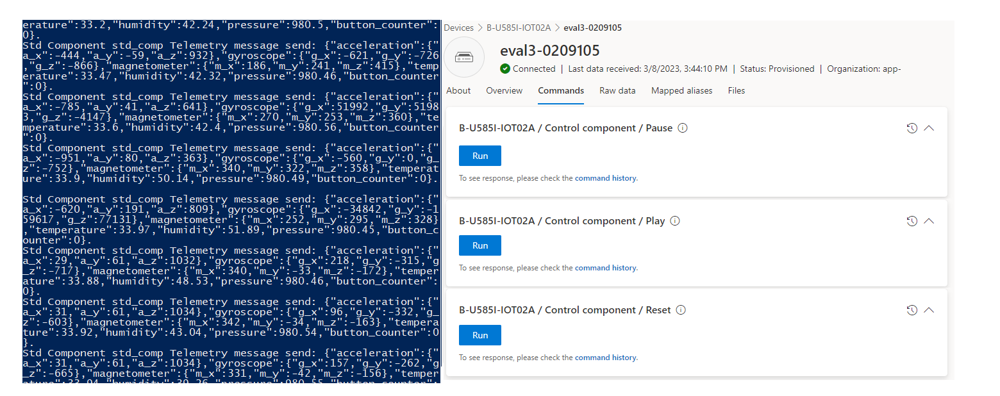
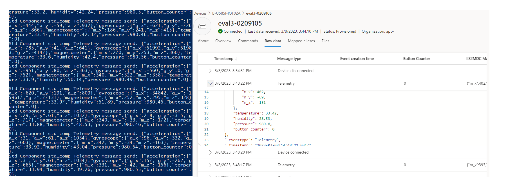
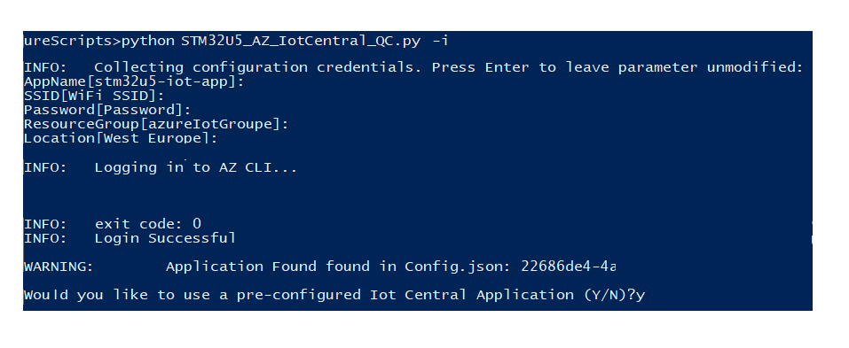

# Azure Scripts - Iot Central QuickConnect 

By default, the application is delivered with pre-compiled binaries compatible with WiFi connectivity.  
If Cellular connectivity is desired, the full application must be recompiled with USE_CELLULAR=1 define instead of USE_WIFI=1 in Non Secure application project.
See [Advanced users](#advanced-users) section for more details.

Python scripts are provided to streamline the setup process. 
These scripts will prompt for your wireless network information and desired cloud configuration credentials before storing them encrypted on [TF-M Protected Storage](https://armkeil.blob.core.windows.net/developer/Files/pdf/PlatformSecurityArchitecture/Implement/IHI0087-PSA_Storage_API-1.0.0.pdf) on STM32U5 internal Flash.  
They will also configure your Azure IoT Central Application using the Azure Command Line Interface.  
The X.509 certificate stored in the STSAFE-A110 will be collected by the script. The Common Name is extracted from the certificate and used by the script as the Registration ID to register your device using Azure Device Provisioning Service.  
The script will then configure the Wi-Fi and cloud credentials into the board via ST-Link VCOM so that your B-U585I-IOT02A can connect to Azure IoT Central.  
The firmware will fetch the Wi-Fi and cloud credentials from the TF-M Protected storage after each reset.

Please install:

- [STM32CubeProgrammer](https://www.st.com/en/development-tools/stm32cubeprog.html) version >= 2.10.0
- [Python](https://www.python.org/downloads/) >= version 3.9, ensure that both python and pip are added to path in installation
- [Pyserial](https://pyserial.readthedocs.io/en/latest/pyserial.html) >= version 3.4, run 'python -m pip install pyserial'
- [Azure CLI](https://pypi.org/project/azure-cli/) >= version 2.46.0, run "python -m pip install azure-cli"
- Add Azure Cli IOT Extension : from folder scripts run the script add_iot_extension.py "python add_iot_extension.py"
- [Halo](https://pypi.org/project/halo/) >= version 0.0.31, run "python -m pip install halo"


For cloud configurations ensure that your board is connected to your PC via a Micro-USB cable as pictured below (CN8 port).

  

</br>
</br>

## Azure IOT Hub - registration and connection flow

The block diagram below illustrates the progression of the script for IOT central connection:

   
<br/>

## Using the Azure IOT Hub QuickConnect script.  
<br/>

1.	Before you run the script, please check that you satisfy the following checklist:
    1.	Your board is connected to your PC with USB cable
    1.	If using WiFi connectivity, a 2.4 GHz Wi-Fi network is available.
    1.	If using Cellular connectivity, a MB1329 board with Quectel BG96 cellular modem and SIM card is connected to B-U585I-IOT02A STMOD+2 port (CN2).
    1.	No app or a script with an open com port with the board
    1.	Only one STM32 board connected to your PC
<br/>

2. Navigate to `Projects\B-U585I-IOT02A\Applications\TFM_Azure_IoT\AzureScripts`   
<br/>

3.  - If you're using IAR EWARM Ide , open a PowerShell window in this directory
    - If you're using STM32CubeIde, open a bash terminal 
<br/>

4. Run the dedicated script with :   

   ```
   - for EWARM open a powerShell terminal
   - for STM32CubeIde open a bash terminal
    Run : 
      python ./STM32U5_AZ_IoT_Central_QuickConnect.py -i  
   ```   
<br/>

5. enter the following information :   

    ```
    AppName[]: 
    SSID[]:
    Password[]:
    ResourceGroup[]:
    Location[]:
    ```

    Note: The AppName must be unique. Your app will be accessible via https://appname.azureiotcentral.com/. Use only lower case letters (a-z), digits (0-9), and dashes (-). Avoid special characters.   


   
<br/>

6. If not already logged in, in your browser, the script will prompt you to login to a Microsoft account.  

   
<br/>

7.	The script will now execute autonomously to configure your environment.  
<br/>

8.	The script will set the correct option bytes, flash the firmware image to the board, and use the provided information to connect the STM32U5 to your 2.4GHz Wi-Fi network.  
<br/>

9.	The script will collect the X.509 Certificate from STSAFE-A110. The certificate Common Name is used as the device RegistrationID and will have the following format: "eval3-0102D095415CD42AA20139"   
<br/>

10.	The script will then configure all the required Azure IoT Central resources for the application that is opened in your browser.

   
<br/>

11.	The script will then provision a new device in your central application and then configure the STM32U5 to connect and communicate telemetry data to that device. If you navigate to the Devices tab in the central application, you will see the STM32U5 is connected after a short delay. Selecting the device will allow you to see the following views:

Telemetry View visualizes the incoming data:

   
<br/>

Command View allows you to send commands to the board:

   
<br/>

Raw Data View allows you to view the incoming JSON payloads:

   
<br/>


12. After the script successfully runs, your device certificate and other connection specific credentials will be saved in cert.pem and Config.json   
<br/>

13.	Do not share the Config.json and keep it private as it contains sensitive information about your Wi-Fi credentials and your Azure account keys   

   
<br/>

14.	To add additional devices to your Central Application, rerun the script, press enter to the input parameters and when prompted with the warning seen below, enter 'y' and proceed with the script execution: 

   
<br/>

</br>
