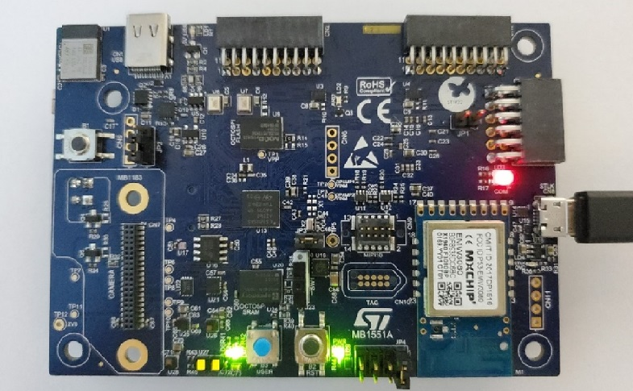
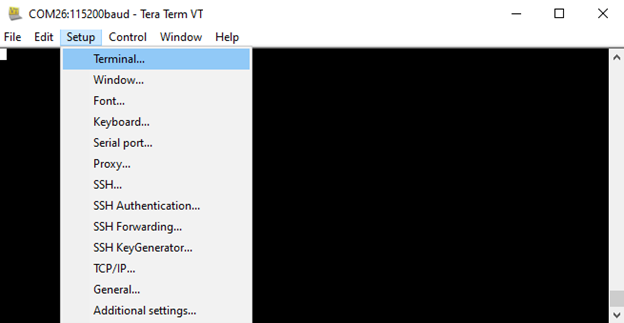
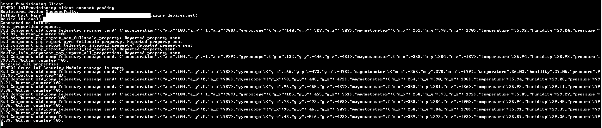

# Connecting to Azure IoT Central manually
<br/>

This section basically describes the steps that are done by the quick connect script.

If you don't have an Azure Iot Central application, you can create one [here](https://apps.azureiotcentral.com/build/new/custom).

Retrieve your application ID Scope, by clicking on 'Permissions', 'Device connection groups'.

   
<br/>

1.	Ensure that the board is connected to your PC as pictured below:

   
<br/>

2. Navigate to `Projects\B-U585I-IOT02A\Applications\TFM_Azure_IoT\TFM_SBSFU_Boot\`
```
    for EWARM IDE : navigare to EWARM and and double click regression.bat

    for STM32CUBE IDE : navigare to STM32CubeIDE and and double click regression.sh
```
    Note: regression.bat(.sh) will enable the TZ option bit on your B-U585I-IOT02A which may alter board functionality for projects outside of this one. 

   
<br/>

3. Once regression.bat(.sh) runs and terminates with no errors, double click TFM_UPDATE.bat (or TFM_UPDATE.sh )

   
<br/>

4.	Once TFM_UPDATE.bat(.sh) runs and terminates with no errors, Open and configure Tera-Term under Setup > Serial Port...

   
<br/>

5.	Select the correct port for your board and configure the Tera-Term as follows: 

   
<br/>

6.	Navigate to Setup > Terminal...

   
<br/>

7.	Check the 'Local echo' box, select 'CR' for Transmit, and select 'OK'

   
<br/>

8.	Reset the board with the black 'RST' button and view the output in Tera-Term    
<br/>

9.	Enter 'y' into the console window to modify the device setting   
<br/>

10. Successively enter:

- '0' then your endpoint 'global.azure-devices-provisioning.net', press Enter
- '1' then your ID scope 'One********', press Enter
- '2' then your WiFi SSID, press Enter
- '3' then your WiFi Password, press Enter
- '4' to write into secure storage
- '8' to reset the device

   

Note: in case of Cellular connection, enter dummy values for WiFi settings.   
<br/>

11. Once the board has restarted, enter 'n' into the console window to keep the device setting or wait the 5 seconds timeout. The device will connect to the WiFi network then display PEM certificate and Registration Id in green:

   

Note: the certificate and Registration ID printed comes from STSAFE device. They are unique for each STSAFE device.   
<br/>

12. Save the printed certificate into a `.pem` file on your computer

   
<br/>

13. Create a device on your Azure Iot Central App.

Click on Device, New, choose a friendly device name, enter the Registration ID printed by the board in 'Device ID', optionally assign a device template, click on Create.

   
<br/>


14. Click on created device on your Azure Iot Central App   

   
<br/>

15. Click on 'Connect', select 'Individual enrollment' as 'Authentication type', select 'Certificates (X.509)' as 'Authentication method'.   

Browse to previously saved .pem file for 'Primary' and 'Secondary', then Save.

   
<br/>

16. Potentially reset the board to skip long backoff mechanism and device should connect successfully and send telemetry messages.  

   
<br/>
<br/>   