# Connecting to Azure IoT Hub manually
<br/>

This section basically describes the steps that are done by the quick connect script.

1. Create an Azure IOT Hub [here](https://learn.microsoft.com/en-us/azure/iot-dps/quick-setup-auto-provision#create-an-iot-hub).

2. Create an Azure Device provisionning system (DPS) [here](https://learn.microsoft.com/en-us/azure/iot-dps/quick-setup-auto-provision#create-a-new-iot-hub-device-provisioning-service).

3. Link the DPS and Iot Hub together [here](https://learn.microsoft.com/en-us/azure/iot-dps/quick-setup-auto-provision#link-the-iot-hub-and-your-device-provisioning-service).

4. From the DPS take note of the ID Scope and Global device endpoint. They will be needed to configure the board (step 12)

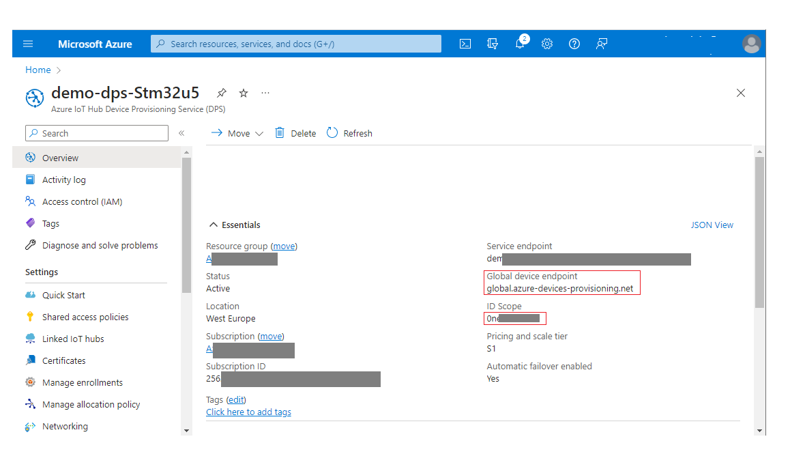   
<br/>


4.	Ensure that the board is connected to your PC as pictured below:

   
<br/>

5. Navigate to `Projects\B-U585I-IOT02A\Applications\TFM_Azure_IoT\TFM_SBSFU_Boot\`
```
    for EWARM IDE : navigare to EWARM and and double click regression.bat

    for STM32CUBE IDE : navigare to STM32CubeIDE and and double click regression.sh
```
    Note: regression.bat(.sh) will enable the TZ option bit on your B-U585I-IOT02A which may alter board functionality for projects outside of this one. 


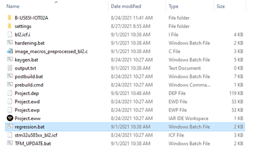   
<br/>

6. Once regression.bat (.sh) runs and terminates with no errors, double click TFM_UPDATE.bat (.sh)

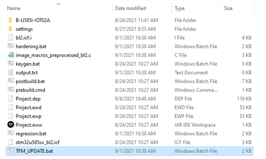   
<br/>

7.	Once TFM_UPDATE.bat (.sh) runs and terminates with no errors, Open and configure Tera-Term under Setup > Serial Port...

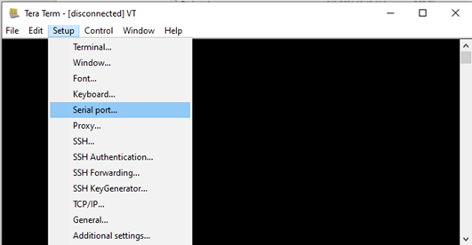   
<br/>

8.	Select the correct port for your board and configure the Tera-Term as follows: 

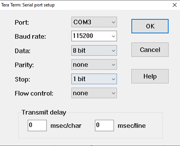   
<br/>

9.	Navigate to Setup > Terminal...

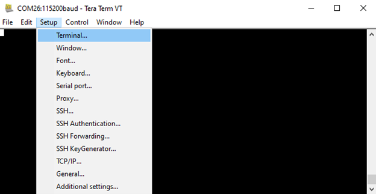   
<br/>

7.	Check the 'Local echo' box, select 'CR' for Transmit, and select 'OK'

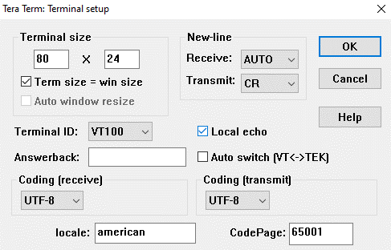   
<br/>

10.	Reset the board with the black 'RST' button and view the output in Tera-Term    
<br/>

11.	Enter 'y' into the console window to modify the device setting   
<br/>

12. Successively enter:

- '0' then your endpoint 'global.azure-devices-provisioning.net', press Enter
- '1' then your ID scope 'One********', press Enter (see step 4)
- '2' then your WiFi SSID, press Enter
- '3' then your WiFi Password, press Enter
- '4' to write into secure storage
- '8' to reset the device

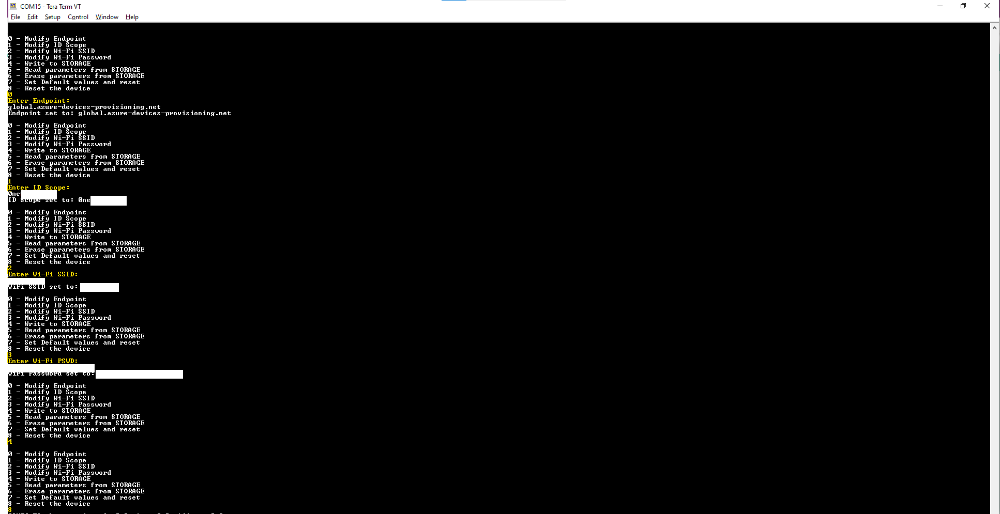   

Note: in case of Cellular connection, enter dummy values for WiFi settings.   
<br/>

13. Once the board has restarted, enter 'n' into the console window to keep the device setting or wait the 5 seconds timeout. The device will connect to the WiFi network then display PEM certificate and Registration Id in green:

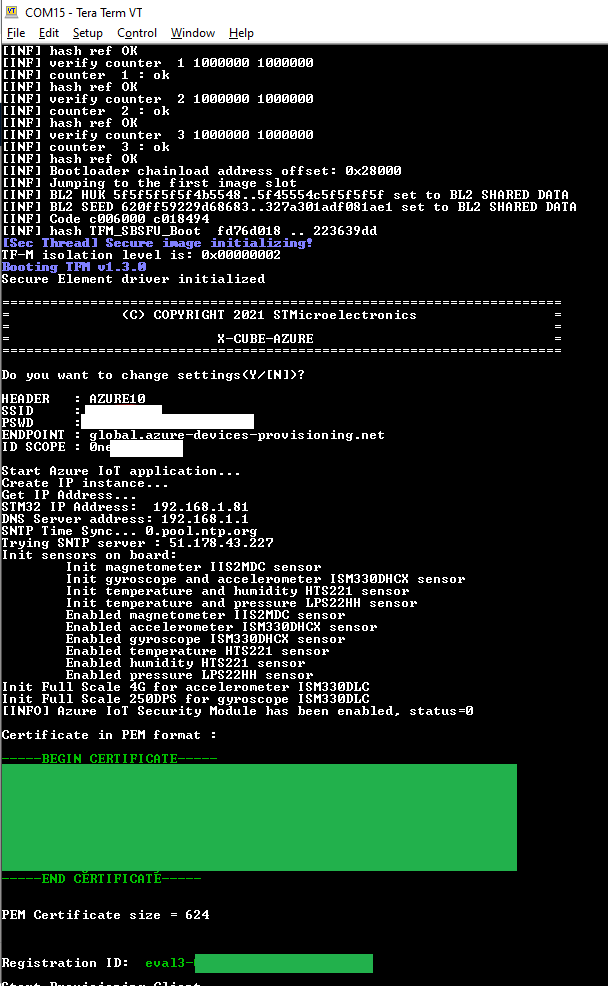   

Note: the certificate and Registration ID printed comes from STSAFE device. They are unique for each STSAFE device.   
<br/>

14. Save the printed certificate into a `.pem` file on your computer

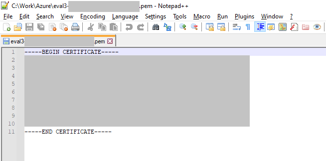   
<br/>

15. Create an individual enrollement on the Device Provisioning Services  :

- Click on Manage enrollements
- Add individual enrollement

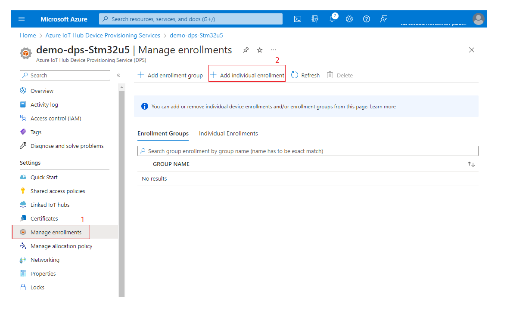 

- choose X.509 Mechanism 
- navigate to your PEM certificate for Primary and Secondary certificates
- enter the Registration ID printed by the board in 'IoT Hub Device ID'
- click on Save.

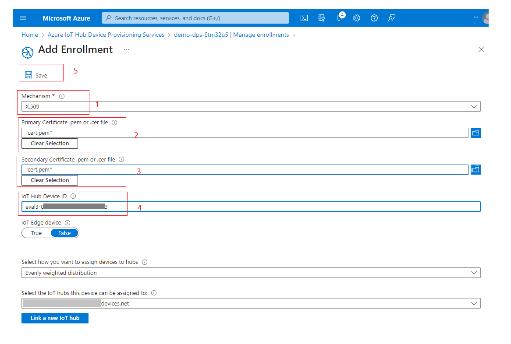   
<br/>


18. Potentially reset the board to skip long backoff mechanism and device should connect successfully and send telemetry messages.  

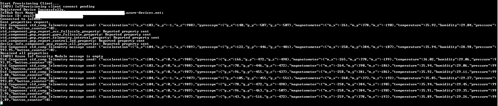   

19. A Connected Device will appear on the IotHub Dashboard with the number of used messages :

  

<br/>
<br/>   