# <mark>TFM Azure IOT Application - Getting started guide - EWARM</mark>  
<br/>
<br/>

# Setting Up your Development Environment

## Step 1: Setup your development board


1. Verify that the 5V_USB_STL and JP3 jumpers are bridged and the remaining jumpers are not bridged.
2. Check that the BOOT0 switch is in the position closest to the STLINK USB connector.
3. Connect a USB micro-B cable between the USB_STLK connector and your computer.

The USB STLK port is located to the right of the MXCHIP WiFi module in the figure. It is used for power supply, programming, debugging, and interacting with the application via UART over USB.


## Step 2: Install Prerequisites Packages

#### __* Download and install the latest version of the following packages:__
- [python](https://www.python.org/downloads/) (with pip)
- [Tera Term](http://www.teraterm.org/)
  

## Step 3: Shorten project path length

EWARM has a path length limitation that requires to use a **subst** drive directory.  
1. Navigate to the directory where you have installed the X-Cube-Azure package.

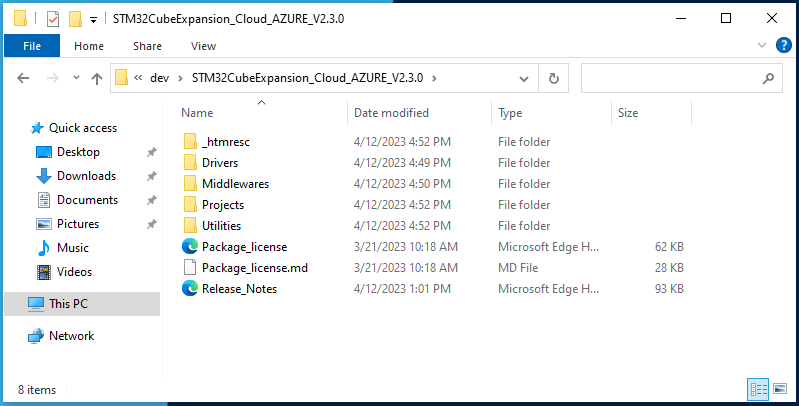

2. Click in the location's selection bar, type in 'cmd' and press 'enter'

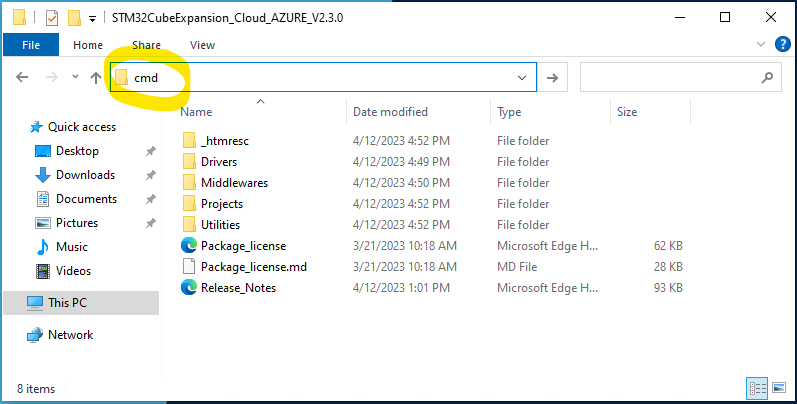

3. A command prompt window will open in that directory.

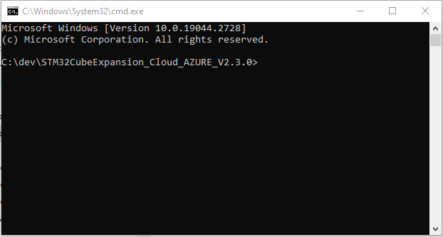

4. In this command prompt type in:
```
subst z: .
```
Use any unused drive letter instead of z: if necessary.  
This will create a new drive letter referencing directly this directory, thus shortening the path length.  

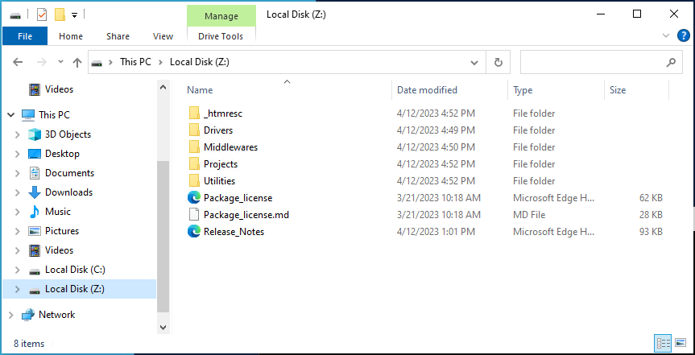

To **un-substs** this drive, use the following command:
```
subst z: /d
```  


## Step 4: Open TFM_Azure_Iot EWARM workspace
1. Open your EWARM IDE (>=9.20.4)
2. Select the **File->Open Workspace** menu
3. Select the subst'd drive and navigate to the TFM_Azure_Iot project folder  
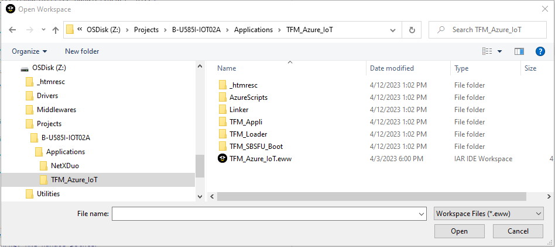
4. Open the TFM_Azure_IoT.eww workspace  
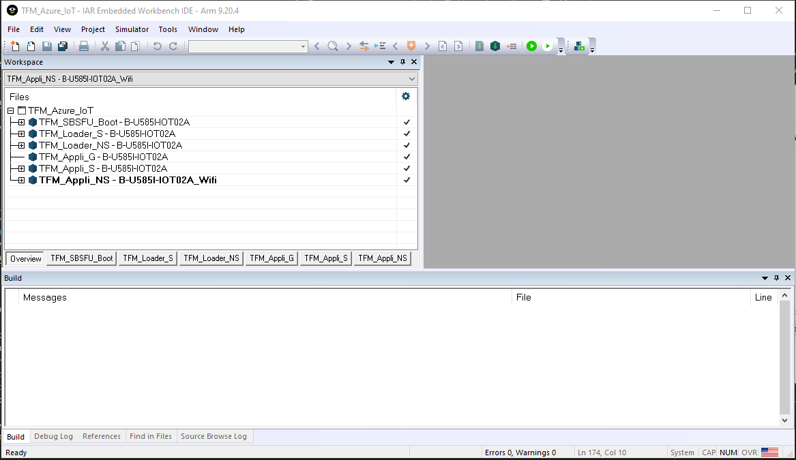

The workspace contains several projects required by the application  
>__TFM_Azure_IoT__  
>- __TFM_SBSFU_Boot__ : Secure Bootloader based on the TFM implementation.  
>- __TFM_Loader_S__ : Secure part of the Loader application.  
>- __TFM_Loader_NS__ : A special application to upload new TFM_Appli (secure and non-secure) via the serial port (Y-Modem).  
>- __TFM_Appli_G__  : Special project to generate Secure API source files based on selected TFM partitions.  
>- __TFM_Appli_S__  : Secure API for the NonSecure application  
>- __TFM_Appli_NS__  : The Actual Azure IoT application  

</br>
The TFM_Appli_NS provides 3 build configurations to choose from:  

- **B-U858-IOT02A_Wifi** for wifi connectivity
- **B-U858-IOT02A_BG96** for cellular connectivity with the Quectel BG96 extension board
- **B-U858-IOT02A_T1SC** for cellular connectivity with the Murata BG96 extension board

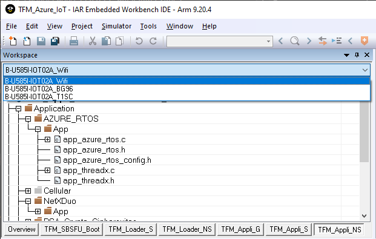


## Step 5: Building the project
To build the entire workspace, press **F8** to open the Batch build dialog window:  
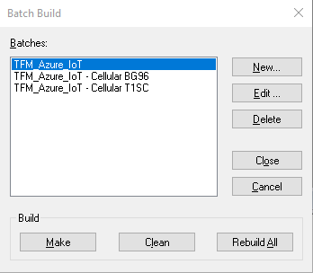

Select the desired build type, then click the **Make** button.  
The IDE will then build the entire workspace and generate the appropriate binaries to flash your board.  
> This process may take some time the first time it is executed.  


## Step 6: Provision your Board

Automated script to configure your Azure environment, provision your board and flash the firmware are provided in the AzureScripts directory.  

Please refer to one of the azure cloud connection methods : 

1. [QC_IOT_HUB](./AzureScripts/readme/README_IOT_Hub_Auto.html) : Connect the board to Azure Iot Hub with QuickConnect script
2. [MANUAL_IOT_HUB](./AzureScripts/readme/README_IOT_Hub_Manual.html) : Connect the board to Azure Iot Hub Manually
3. [QC_IOT_CENTRAL](./AzureScripts/readme/README_IOT_Central_Auto.html) : Connect the board the board to Azure Iot Central with QuickConnect script
4. [MANUAL_IOT_CENTRAL](./AzureScripts/readme/README_IOT_Central_Manual.html) : Connect the board to Azure Iot Central Manually


## Step 7: Flash the firmware

To flash the firmware :  
- connect your board via USB   
  

- navigate to `Projects\B-U585I-IOT02A\Applications\TFM_Azure_IoT\TFM_SBSFU_Boot\EWARM`  
- double click on `TFM_UPDATE.bat`  

### Step 8: Connecting to the board
The application output can be monitored thru the serial port.  

1. Open and configure Tera-Term under **Setup -> Serial Port...**   
  
2. Select the correct port for your board and configure Tera-Term as follow:  
  
3. Navigate to **Setup -> Terminal**  
  
4. Check the 'Local echo' box, select 'CR' for Transmit, and select 'OK'  
  
5. Reset the board with the black 'RST' button and view the output in Tera-Term


## Step 9: Debugging

1.	Right click on TFM_Appli_NS in the IAR workspace and select 'Options...' 
2.	Under 'C/C++ Compiler' and 'Optimization' set Level to 'None'

    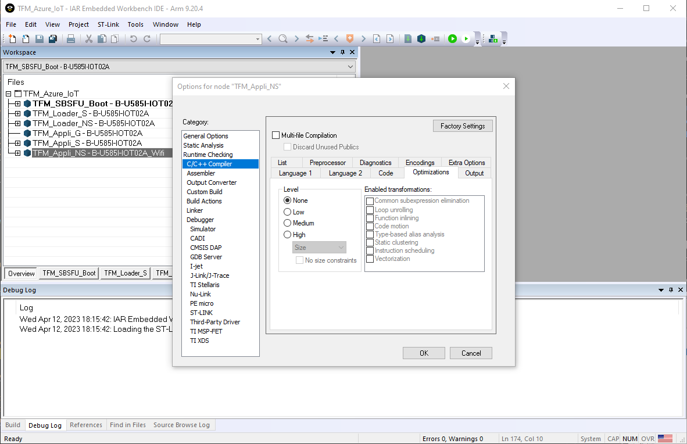

3. Do the same for Project_ns-B-U585I-IOT02A_TFM_Loader_S
4. Build the project
5. Right click on TFM_SBSFU_Boot project in the IAR workspace and select it as the active project
6. Right click on TFM_SBSFU_Boot project in the IAR workspace and select 'Options'
7. Under **'Debugger' -> 'Setup'**

    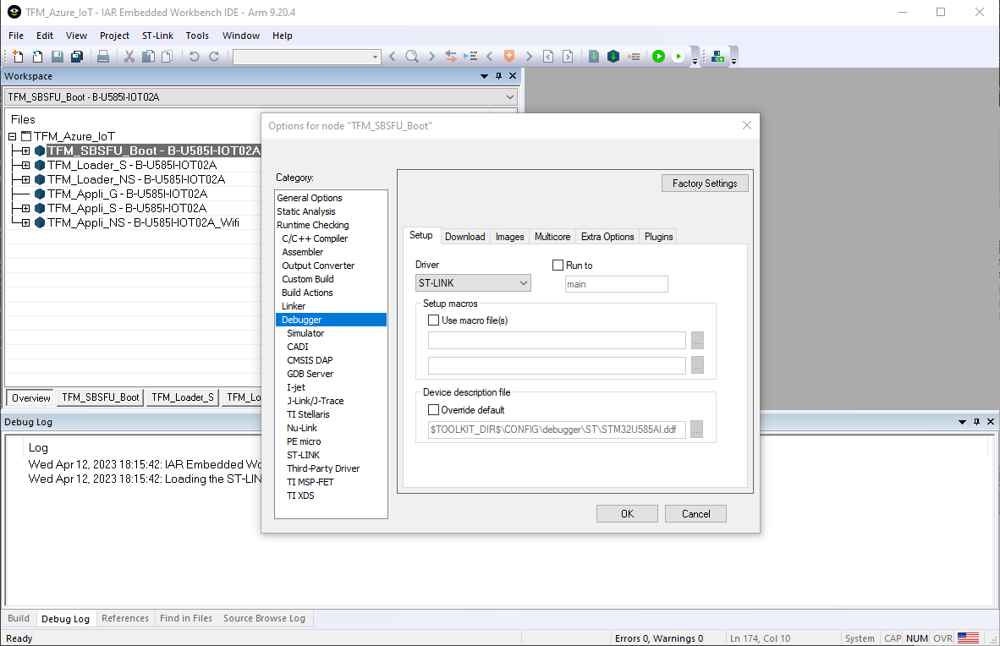

    - Select **'ST-LINK'** in the Driver drop box.
    - Uncheck **'Run to'**  

8. Under **'Debugger' -> 'Images'**

    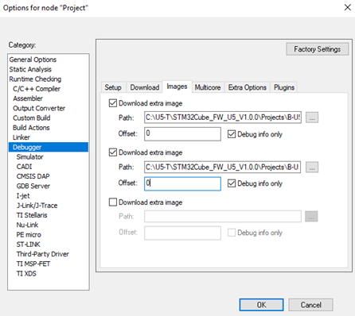  
    
    - check the two first 'Download extra image' boxes, set offset at '0' and check 'Debug info only' for each.  
    - Select `Projects\B-U585I-IOT02A\Applications\TFM_Azure_IoT\TFM_Appli\EWARM\Secure\B-U585I-IOT02A\Exe\B-U585I-IOT02A.out` as first path.
    - Select `Projects\B-U585I-IOT02A\Applications\TFM_Azure_IoT\TFM_Appli\EWARM\NonSecure\B-U585I-IOT02A\Exe\B-U585I-IOT02A.out` as second path.

    

10. Flash the Firmware
11. Set desired breakpoints in IAR EWARM
12. After the Firmware Image is Built and Flashed to the board. Click 'Project' in the taskbar and select 'Attach to Running Target' 

    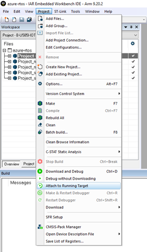

13. Press the black 'RST' Button on the board to reset and view the debugger in IAR EWARM

    
