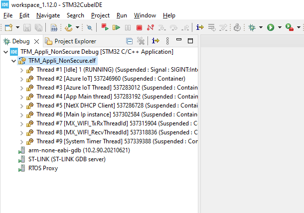

# <mark>TFM Azure IOT Application - Getting started guide - STM32CubeIDE</mark>  
<br/>
<br/>

# Setting Up your Development Environment

## Step 1: Setup your development board


1. Verify that the 5V_USB_STL and JP3 jumpers are bridged and the remaining jumpers are not bridged.
2. Check that the BOOT0 switch is in the position closest to the STLINK USB connector.
3. Connect a USB micro-B cable between the USB_STLK connector and your computer.

The USB STLK port is located to the right of the MXCHIP WiFi module in the figure. It is used for power supply, programming, debugging, and interacting with the application via UART over USB.


## Step 2: Install Prerequisites Packages

### __Windows__
The project build system needs a unix or posix-like shell. There are many options for installing such a shell on windows.  
This guide assume you are using GitBash which is included in the Git for Windows package.  
Any other compatible shell will work, except the one provided by the windows subsystem for windows (wsl).


#### __* Download and install the latest version of the following packages:__
- [python](https://www.python.org/downloads/) (with pip)  
- [git for windows](https://gitforwindows.org/)
- [Tera Term](http://www.teraterm.org/)
  

#### __* Add bash.exe to your Path:__
In order to use the project scripts and the related STM32CubeIDE launch files, you must include bash.exe in your system path.

1. Locate your preferred version of bash.exe and determine the windows path to it.

    For reference, the default location for GitBash is ```C:\Program Files\Git\bin```.

2. Run the following command to open the environment variable editor from Control Panel:
```
rundll32 sysdm.cpl,EditEnvironmentVariables
```

3. Select the "Path" user environment variable and click "Edit".

4. Select "New" and then paste the path to the directory containing bash.exe found above.

5. Press OK and OK to exit the environment variable editor.

6. Log out of your windows session and then log back in to allow the environment variable changes to take effect.

### __Linux__
Install dependencies using your distribution's package manager and add the required additional python modules:

#### Debian based (.deb / apt)
```
sudo apt install python3 python-is-python3
pip install numpy intelhex jinja2
```
#### Redhat (.rpm / dnf / yum)
```
sudo dnf install -y python3 python-is-python3
sudo dnf groupinstall -y "Development Tools" "Development Libraries" --skip-broken
pip install numpy intelhex jinja2
```

## Step 3: Install STM32CubeIDE
Download the latest version of STM32CubeIDE from the [STMicroelectronics website](https://www.st.com/en/development-tools/stm32cubeide.html).

At the time of this writing, Version 1.12.0 was the latest release:
- [STM32CubeIDE](https://www.st.com/en/development-tools/stm32cubeide.html)

Abridged installation instructions are included below. Please refer to the [STM32CubeIDE Installation guide](https://www.st.com/resource/en/user_manual/um2563-stm32cubeide-installation-guide-stmicroelectronics.pdf) and the included instructions for your platform if additional help is needed.

The projects in this repository have been verified with versions 1.12.0 of STM32CubeIDE.

### Windows Normal Install
1. Download the [STM32CubeIDE windows zip archive][https://www.st.com/en/development-tools/stm32cubeide.html].
2. Unzip the package by double-clicking.
3. Run the extracted installer executable.

### Ubuntu Linux, Debian Linux, etc (deb package)
Open a terminal window and follow the steps below to install STM32CubeIDE on a Debian based Linux machine.

Download the STM32CubeIDE Linux generic installer package
```
wget <URL HERE>
```

Extract the package
```
unzip en.st-stm32cubeide_*_amd64.deb_bundle.sh.zip
```

Add execute permissions to the install package
```
chmod +x st-stm32cubeide_*_amd64.deb_bundle.sh
```

Extract the debian packages from the bundle:
```
mkdir -p cubeide_install
./st-stm32cubeide_1.9.0_12015_20220302_0855_amd64.deb_bundle.sh --tar xvf --directory cubeide_install .
```

Install the debian packages
```
export LICENSE_ALREADY_ACCEPTED=1
sudo apt install -y ./cubeide_install/st-stm32cubeide-1.9.0-12015-20220302-0855_amd64.deb ./cubeide_install/st-stlink-udev-rules-1.0.3-2-linux-all.deb ./cubeide_install/st-stlink-server-2.1.0-1-linux-amd64.deb
```

Start the IDE
```
/opt/st/stm32cubeide_1.9.0/stm32cubeide_wayland
# Or
/opt/st/stm32cubeide_1.9.0/stm32cubeide
```

### Redhat derivatives (rpm package)
Open a terminal window and follow the steps below to install STM32CubeIDE on a Redhat based linux machine.

Download the [STM32CubeIDE linux rpm installer package][ide_url_rpm]
```
wget <URL HERE>
```

Extract the package
```
unzip en.st-stm32cubeide_*amd64.rpm_bundle.sh.zip
```

Add execute permissions to the install package
```
chmod +x st-stm32cubeide_*amd64.rpm_bundle.sh
```

Start the installation script and follow the prompts on the command line.
```
sudo ./st-stm32cubeide_1.9.0_12015_20220302_0855_amd64.rpm_bundle.sh
```

### Linux - Generic Installer
Open a terminal window and follow the steps below to install STM32CubeIDE on a generic linux machine.

Download the STM32CubeIDE [linux generic installer package][ide_url_lin]:
```
wget <URL>
```

Extract the package
```
unzip en.st-stm32cubeide*amd64.sh.zip
```

Add execute permissions to the install package
```
chmod +x st-stm32cubeide_*amd64.sh
```

Start the installation script and follow the prompts on the command line.
```
./st-stm32cubeide_1.9.0_12015_20220302_0855_amd64.sh
```


## Step 4: Import Projects into STM32CubeIDE
1. Open STM32CubeIDE.
2. When asked to open a workspace directory, select the default one or choose your preferred development location.

> Note: If you are not asked to select a workspace when STM32CubeIDE start, you may access this dialog via the ***File -> Switch Workspace -> Other*** menu item.  

3. Select ***File -> Import***.  
4. Select ***General -> Existing Projects Into Workspace*** in the ***Select an Import Wizard*** dialog and click **Next >**.  
5. Click **Browse** next to the *Select root directory* box and navigate to the root of the TFM_Azure_Iot directory.  
6. Click the check box next to all projects and then click **Finish**.  

> Note:  
> * Ensure that *Search nested projects* **is selected**  
> * Ensure that *copy projects into workspace* **is not selected**  


## Step 5: Build Firmware image and Flash your development board
After importing the workspace into STM32CubeIDE, you will end up with several projects organized in 3 top level groups.


__TFM_Appli__   
* __TFM_Appli_NonSecure__  : Actual Azure IoT application  
* __TFM_Appli_Secure__  : Secure API for the NonSecure application  
* __TFM_Appli_Secure_G__  : Special project to generate Secure API source files based on selected TFM partitions.  

__TFM_Loader__  
* __TFM_Loader_NonSecure__ : A special application to upload new TFM_Appli (secure and non-secure) via the serial port (Y-Modem).  
* __TFM_Loader_Secure__ : Secure part of the Loader application.  

__TFM_SBSFU_Boot__ : Secure Bootloader based on the TFM implementation.  

</br>


### Building
In the **Project Explorer** pane of STM32CubeIDE, select the non-secure project by clicking it's name **TFM_Appli_NonSecure**  
Then click on the arrow next to the hammer icon to select the configuration you want to build (Wifi, Cellular BG96 or Cellular Type1SC)  


Next, click on hammer icon to build the project.  
The project are linked together, so building TFM_Appli_NonSecure will trigger the build process of all related projects (ie, TFM_Appli_Secure, TFM_Appli_Secure_G, TFM_Loader_NonSecure, TFM_Loader_Secure, TFM_SBSFU_Boot)

> Note: You may also build the current project using the **Project**->**Build Project** menu item.

## Step 6: Provision and Flash Your Board

### 6.1 - Connect your board via USB.  

  

### 6.2 - Using the QuickConnect scripts.
Automated script to configure your Azure environment, provision your board and flash the firmware are provided in the AzureScripts directory.  

Please refer to one of the following documentation : 

1. [QC_IOT_HUB](./AzureScripts/readme/README_IOT_Hub_Auto.html) : Connect the board to Azure Iot Hub with QuickConnect script
2. [MANUAL_IOT_HUB](./AzureScripts/readme/README_IOT_Hub_Manual.html) : Connect the board to Azure Iot Hub Manually
3. [QC_IOT_CENTRAL](./AzureScripts/readme/README_IOT_Central_Auto.html) : Connect the board the board to Azure Iot Central with QuickConnect script
4. [MANUAL_IOT_CENTRAL](./AzureScripts/readme/README_IOT_Central_Manual.html) : Connect the board to Azure Iot Central Manually


### 6.3 - Using the provided external tools shortcut.

The external tools shortcuts can only flash and manage your board's firmware.  
If you need to configure your Azure environment and provision your board, please proceed with the QuickConnect documentation referenced above.


Several tools are pre-configured:  
1. Disable TZ: if you want to revert your board to non-tfm configuration.  
2. Generate Data img: This script will generate the initial data images (secure and non-secure).   
This script needs to be run once before flashing your board.  
3. Regression: This script will prepare you board for TFM application.  
It will enable the Trust-Zone and set various parameters.  
This script needs to be run only once before anything else.  
4. Reset board: restart the MCU by issuing a hard-reset command.  
5. TFM Update (Appli_NonSecure): flash only the non-secure application.  
Used if you've only rebuild the non-secure application.   
6. TFM Update (Appli_Secure): flash only the secure application.  
Used if you've only rebuild the secure application.  
7. TFM Update (all): flash all application parts (Appli, loader, data and bootloader)  


Before anything else, you must prepare your board with the **regression's script** (this needs to be done only once)  
Then you should flash all the application parts with the **TFM_UPDATE script**.  


### 6.4 - Connecting to the board
The application output can be monitored thru the serial port.  

1. Open and configure Tera-Term under **Setup -> Serial Port...**   
  
2. Select the correct port for your board and configure Tera-Term as follow:  
  
3. Navigate to **Setup -> Terminal**  
  
4. Check the 'Local echo' box, select 'CR' for Transmit, and select 'OK'  
  
5. Reset the board with the black 'RST' button and view the output in Tera-Term

## Step 7: Debugging

The project workspace provides a pre-configured debug environment.  
> The board should have be flash with the build firmware prior to starting the debug session.  

Click the black arrow next to the bug icon and select **TFM_Appli_NonSecure Debug**  

  

STM32CubeIde will then connect to the running process on the board and start the debugging session.  



