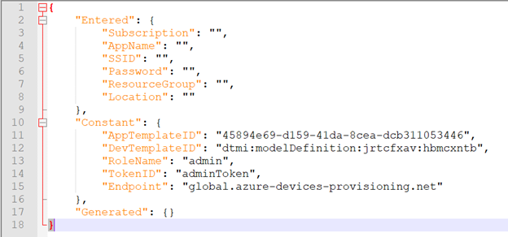

# <mark>TFM Azure IOT Application</mark>  
 

# Application Licence Clarification

The TFM application components are licensed by ST under Ultimate Liberty
license SLA0044. Read the file q_a.txt for Application Licence Clarification.  
Except as expressly mentioned, other rights are granted with the STSAFE
components, where license SLA0088 is applied.

 
 

# Application Description

This application provides an example of Azure RTOS NetX/NetXDuo Azure IoT Plug and Play usage
of STM32 B-U585I-IOT02A board with either Cellular or WiFi connectivity and hardware security features.

This reference design integrates the following:

  - [Azure-RTOS](https://azure.microsoft.com/en-us/services/rtos/)
  - [TF-M 1.3](https://www.trustedfirmware.org/projects/tf-m/) with [STSAFE-A110](https://www.st.com/en/secure-mcus/stsafe-a110.html) Integration
  - [ARM TrustZone](https://www.st.com/resource/en/application_note/dm00625692-stm32l5-series-trustzone-features-stmicroelectronics.pdf)
  - [IoT Central](https://docs.microsoft.com/en-us/azure/iot-central/)
  - [IoT Hub](https://learn.microsoft.com/en-us/azure/iot-hub/)
  - [Azure Device Update](https://learn.microsoft.com/en-us/azure/iot-hub-device-update/)
  - [Device Provisioning Service (DPS)](https://docs.microsoft.com/en-us/azure/iot-dps/)
  - X.509 certificate attestation
  - [Azure Plug and Play](https://docs.microsoft.com/en-us/azure/iot-develop/overview-iot-plug-and-play)
  - Prebuilt firmware for Quick Connect scripts (STM32CubeIDE binaries with ADU feature enabled)
  - Wi-Fi and Azure Connection Credentials stored in [TF-M Protected Storage](https://armkeil.blob.core.windows.net/developer/Files/pdf/PlatformSecurityArchitecture/Implement/IHI0087-PSA_Storage_API-1.0.0.pdf)
  - [Ultra-Low-Power STM35U585](https://www.st.com/en/microcontrollers-microprocessors/stm32u5-series.html)
  - Real time sensor data published and displayed in Azure cloud

 
 

# Directory contents

- Linker: Linker files definition shared between TFM_SBSFU_Boot, TFM_Appli and TFM_Loader projects.
- TFM_SBSFU_Boot: Secure boot and secure firmware update application.
- TFM_Appli: Secure services application and Azure_IoT application.
- TFM_Loader: Local loader application.
- AzureScripts: QuickConnect scripts

 
 

# Keywords

RTOS, Network, ThreadX, NetXDuo, WIFI, MQTT, DNS, TLS, MXCHIP, UART, STSAFE, STSAFE-A110, TFM, TF-M 1.3, SBSFU, Azure-RTOS, IoT Central

 
 

# Hardware and Software environment

- This example runs on B-U585I-IOT02A board with either WiFi or cellular modem.
- By default the WiFi connectivity is enabled with on-board WiFi module (MXCHIP:EMW3080) used with this configuration :
   + MXCHIP Firmware 2.1.11
   + SPI mode used as interface
   + Bypass mode (TCP-IP stack is handled by NetXDuo, not by Wi-Fi module)  

  The EMW3080B MXCHIP Wi-Fi module firmware must be version 2.1.11. If update is needed, a package is available at <https://www.st.com/en/development-tools/x-wifi-emw3080b.html>.
  To update, follow the instructions given at the above link, using the EMW3080updateV2.1.11RevC.bin flasher under V2.1.11/SPI folder.

- In case of Cellular connectivity, the supported cellular modem is the Quectel BG96 on ST MB1329 extension board.
  It connects to STMOD+2 connector CN2 on B-U585I-IOT02A board.

- This application has been tested with [B-U585I-IOT02A](https://www.st.com/en/evaluation-tools/b-u585i-iot02a.html) (MB1551-U585AI) board Revision: RevC and can be adapted to other supported device and development board.
- This application uses USART1 to display logs. The serial terminal ([Tera-Term](https://osdn.net/projects/ttssh2/downloads/74780/teraterm-4.106.exe/) for example) configuration is as follows:
   - BaudRate = 115200 baud
   - Word Length = 8 Bits
   - Stop Bit = 1
   - Parity = None
   - Flow control = None
   - New Line Receive and Transmit: CR
- To build this application (not needed when Quick Connect is used):
   - IAR Embedded Workbench IDE version >= 9.20 is required. There is a [free trial](https://www.iar.com/products/architectures/arm/iar-embedded-workbench-for-arm/#:~:text=Free%20trial%20of%20IAR%20Embedded%20Workbench%20for%20Arm) available.  
   Note that it is recommended to place the unzipped folder directly at root of `C:\` drive or to use a virtual drive with [subst command](https://docs.microsoft.com/windows-server/administration/windows-commands/subst). Indeed IAR project with a long file path may not build correctly.
   - STM32CubeIDE >= 1.10.0
 - To flash this application:
   - [STM32CubeProgrammer](https://www.st.com/en/development-tools/stm32cubeprog.html) version >= 2.10.0
- If Wi-Fi connectivity is chosen, a 2.4 GHz Wi-Fi router connected to the Internet with DHCP enabled and the router's SSID and password is also required for the STM32 B-U585I-IOT02A development board to connect to the cloud.
- If Cellular modem is chosen, a SIM card with suitable data plan must be inserted in SIM slot on cellular modem board.

 
 

# Known limitations

  - IAR build not working if cube package is installed on a path with a space, or a long path.  
  - STM32CubeIDE: Only Release configuration is supported due to flash mapping constraint.
    To allow debugging in Release configuration, the debug level is -g3.   

 
 

# Table of contents
1. [Azure IoT Central - QuickConnect scripts](#azure-scripts---quickconnect)  
2. [Getting started guides: Configuring / Building / Debugging](#advanced-users)   
3. [Azure IoT Central Application device template](#azure-iot-central-application-device-template)
4. [Trouble shooting](#trouble-shooting)   

 

---   

 

# 1. Azure Scripts - QuickConnect

By default, the application is delivered with pre-compiled binaries compatible with WiFi connectivity.
If Cellular connectivity is desired, the full application must be recompiled with the dedicated configuration in Non Secure application project. See Advanced users section for more details.

Please refer to one of the azure cloud connection methods : 

1. [QC_IOT_HUB](./AzureScripts/readme/README_IOT_Hub_Auto.html) : Connect the board to Azure Iot Hub with QuickConnect script
2. [MANUAL_IOT_HUB](./AzureScripts/readme/README_IOT_Hub_Manual.html) : Connect the board to Azure Iot Hub Manually
3. [QC_IOT_CENTRAL](./AzureScripts/readme/README_IOT_Central_Auto.html) : Connect the board the board to Azure Iot Central with QuickConnect script
4. [MANUAL_IOT_CENTRAL](./AzureScripts/readme/README_IOT_Central_Manual.html) : Connect the board to Azure Iot Central Manually

# 2. Getting started guides: [Configuring / Building / Debugging]{#advanced-users}

For device developers, the suggested next step is to look at the other tutorials in the series [Getting started with Azure RTOS](https://go.microsoft.com/fwlink/p/?linkid=2129824).   
 

This application is provided with pre-configured projects for EWARM and STM32CubeIDE.  
Depending on your development environment, please refer to one of the documentation below:

1. [EWARM](./Getting_started_EWARM.html) : Details procedure to configure, build and debug the application with EWRAM (Windows only)
2. [STM32CubeIDE](./Getting_started_STM32CubeIDE.html) : Details procedure to start configure, build and debug the application with STM32CubeIDE (Windows and Linux)

 

# 3. Azure IoT Central Application device template

For a better experience with Azure IoT Central Application, you can use the following device template:

`Projects\B-U585I-IOT02A\Applications\TFM_Azure_IoT\TFM_Appli\NonSecure\Config\AzureIotCentral\dtmi_stmicroelectronics_b_u585i_iot02a_standard_fw;3.json`

Please refer to [Azure IoT Central Application device template documentation](https://docs.microsoft.com/en-us/azure/iot-central/core/concepts-device-templates) for more information.

 

# 4.Trouble shooting

## 4.1 IAR Build Issues

If you are experiencing build issues in IAR, ensure that the project is extracted directly at root of your `C:\` drive. If this is not possible you can use the [subst](https://docs.microsoft.com/en-us/windows-server/administration/windows-commands/subst) command to create a virtual drive.

 

## 4.2 Running Quick Connect Multiple Times

The state of Config.json determines how the script executes. If you have already run the STM32U5_AZ_IotCentral_QC.py script once, Config.json will be permanently modified. If you want to add another device to your central application on a second integration of the script, no changes need to be made to Config.json. If you would like to create another application, you will have to set Config.json to the default configuration as pictured below.

   

 

## 4.3 Delete an existing app in Azure IoT Central

To do so navigate to the drop menu on the left and select 'Application'

   
 

Under the Management tab, scroll down to and select 'Delete'.

   
 

## 4.4 How I determine my board's Registration ID?

The X.509 certificate and Registration ID (Common Name) are printed on the terminal after each start.   

   
 

## 4.5 More questions?

Online support requests can be submitted at [https://my.st.com/ols](https://my.st.com/ols).   
